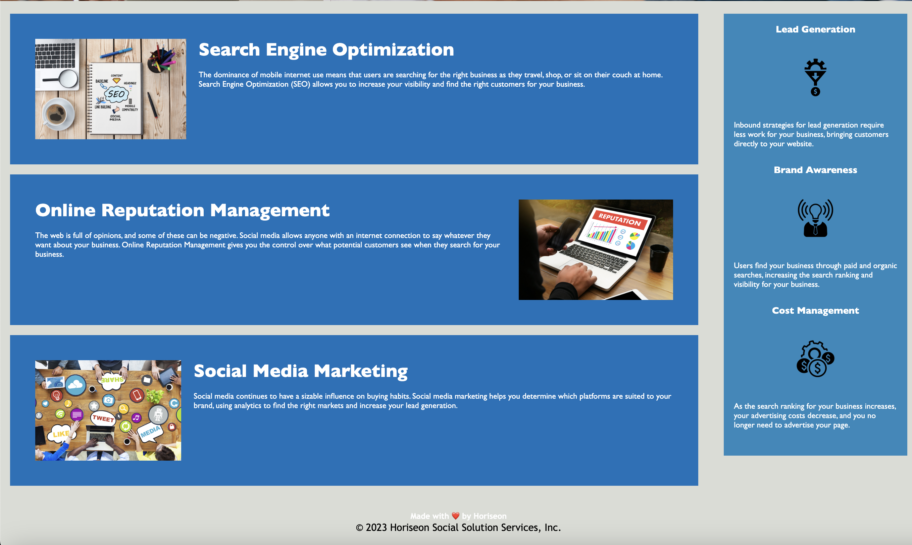

# Code Refactor Starter Code

## Screenshot

## Live Deployment Link:

[Deployment Link](https://mjjust31.github.io/Code.Refactor)

## Description

Used previous code to update to semantic HTML text and combine CSS style attributes to reduce redundancy and make the code more efficient. After the review, the deployed link should reflect the same as it did before with the Horiseon page.

User Story:

AS A marketing agency
I WANT a codebase that follows accessibility standards
SO THAT our own site is optimized for search engines

Acceptance Criteria

GIVEN a webpage meets accessibility standards
WHEN I view the source code
THEN I find semantic HTML elements
WHEN I view the structure of the HTML elements
THEN I find that the elements follow a logical structure independent of styling and positioning
WHEN I view the image elements
THEN I find accessible alt attributes
WHEN I view the heading attributes
THEN they fall in sequential order
WHEN I view the title element
THEN I find a concise, descriptive title

## Table of Contents

- [Installation](#installation)

- [Usage](#usage)

- [Contributing](#contributing)

- [Tests](#tests)

- [License](#license)

- [Questions](#questions)

## Installation

No installations required.

## Usage

This project only uses HTML and CSS files and is not intended for any specific use except to understans semantic HTML and css file better. In the HTML, there were many "divs" that could be changed to make it easier to read and accessible. I sorted the HTML in the following way: header, main, aside, and footer to make it easier to visualize the page without needing to. I also divided the content in sections to visualize the "break" on the page. I also added a title and alt to the images.

In the CSS code, there were many items that held the same design features that would be condensed for more efficient code. As I review, I attempted to keep items in order when reviewing the html. For example, keeping the header near the top of the CSS and moved classes lower if they appeared lower on the page.

Some of the same similarities were and were consolidated for more efficient code.

## Contributing

The best way to contribute is to review the code and mark and chnages that can provide cleaner code in bot the HTML and CSS files.

# Tests

No tests

## License

This project is licensed under the MIT License for more information, you can visit here: [MIT License](https://opensource.org/licenses/MIT)

## Questions

For any questions, please contact me at mj.justmann@gmail.com.

## Resources used for the project

1. https://www.w3schools.com/css/css_selectors.asp
2. https://www.markdownguide.org/cheat-sheet/

